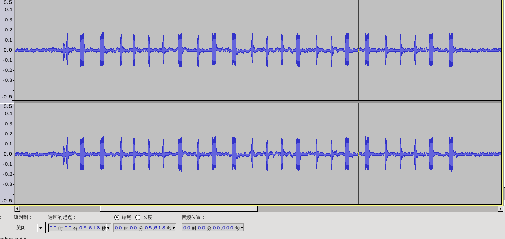
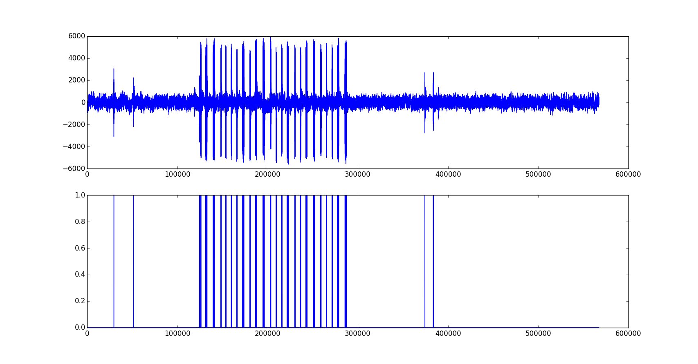

对于网络隔离的堡垒主机，利用主板蜂鸣器实现的边信道攻击。

### 原理

- #### 文件编码为音频

将文件内容进行二进制编码，调用主板蜂鸣器，长音为“1”，短音为“0”，最终转化为声音传输出去。

也可以利用音量大小，音调高低来编码。

原始声频文件波形图：

- #### 音频还原

录制的音频可以解码恢复为原始文件。

### 使用

- 文件编码： python read_file_and_play_sound.py
- 音频解码： python sound2raw.py
